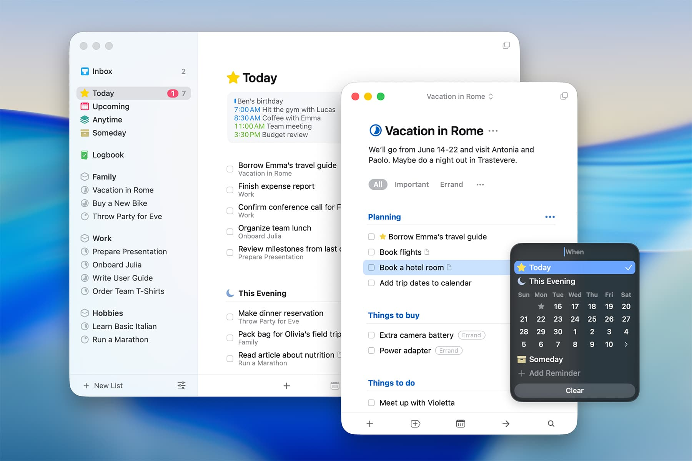
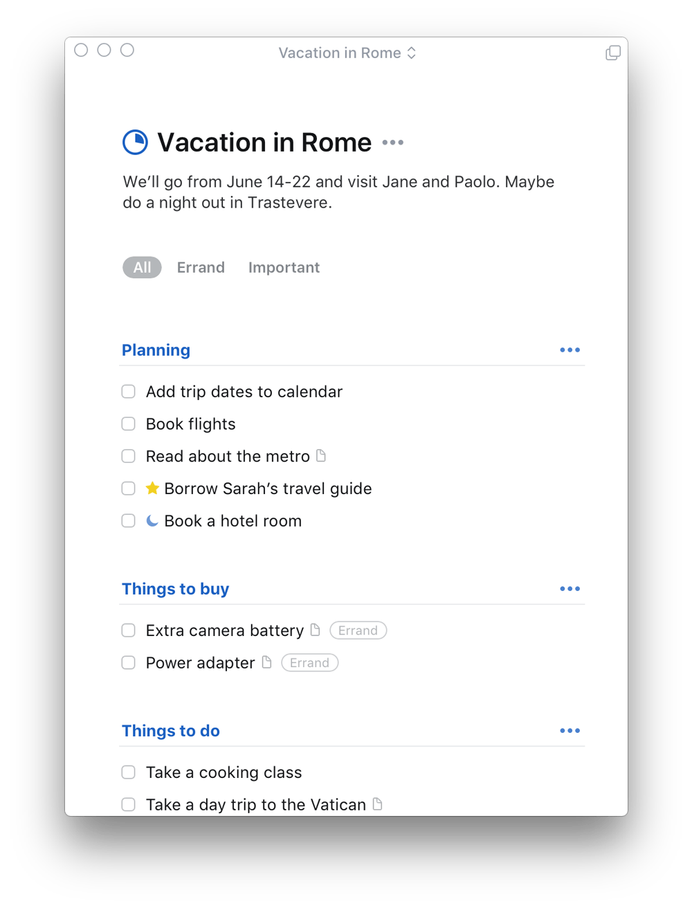
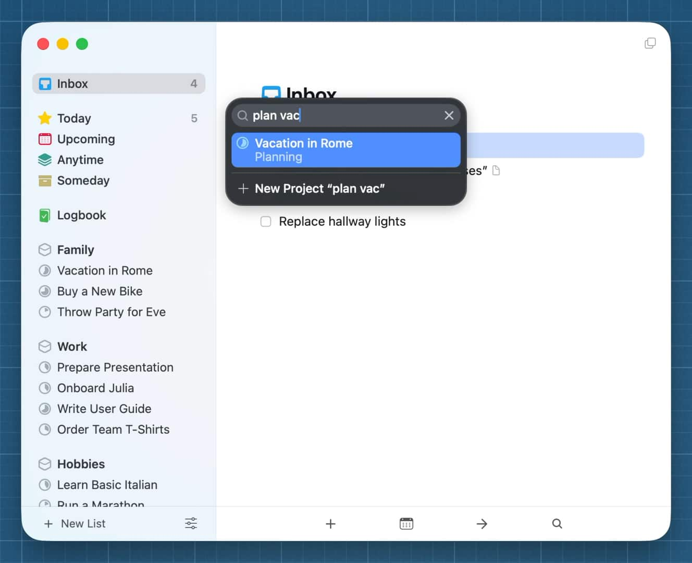
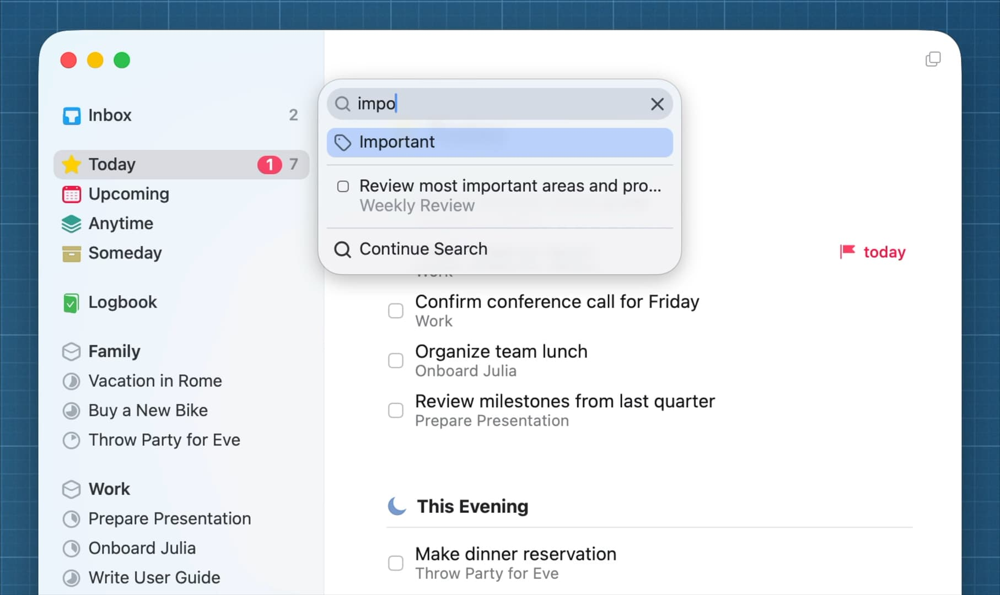

# OpenLoop Desktop Design System

Status: implementation specification  
Platform: macOS, SwiftUI with AppKit integration  
Reference baseline: Things 3 for macOS, including the macOS 26 visual refresh  
Last updated: 2026-08-21

## 1. Product design thesis

OpenLoop should feel calm while idle and powerful while manipulated.

The primary interface is not a dashboard. It is a quiet, spatial list of the user's present commitments, captured thoughts, semantic threads, and retained evidence. Advanced capability appears only when the user's behavior asks for it:

- selection reveals contextual actions;
- typing invokes navigation and search;
- dragging reveals destinations and structure;
- speaking invokes a compact live surface;
- opening an item reveals detail;
- opening Advanced reveals the local engine and evidence;
- asking a question activates semantic retrieval;
- approving an action activates tools.

The system must preserve this hierarchy:

```text
Speak or type
    ↓
Capture evidence immediately
    ↓
Understand quietly
    ↓
Place in a visible context
    ↓
Surface only relevant or repeated meaning
    ↓
Let the user inspect, move, ask, or act
```

The interface must never make the user understand the internal pipeline before they can capture a thought. It must also never hide progress when the user explicitly asks the system to transcribe, process, move, or act.

### 1.1 Core principles

1. **Content is the chrome.** Titles, rows, headings, whitespace, and direct manipulation carry the hierarchy. Avoid wrapping ordinary list content in cards.
2. **One primary surface.** The current list or thread owns the center of the window. Supporting information is subordinate.
3. **Calm at rest, expressive in motion.** The default state is visually quiet. Hover, selection, drag, recording, and processing can become vivid.
4. **Fast capture, deferred organization.** Capture must not require project, date, mode, language, or model choices.
5. **Time and context are separate dimensions.** `Now`, `Upcoming`, `Later`, and `Someday` express time; spaces and threads express context.
6. **Direct manipulation has keyboard parity.** Every drag action has a Move command, and every important command is available without a pointer.
7. **Intelligence remains latent.** The system records observations and connections without converting every sentence into a task or interrupting the user.
8. **Visible execution, quiet machinery.** Show immediate status and errors in the working surface; keep model names, frame counts, and routing details in Advanced.
9. **Reversibility earns trust.** Move, complete, rewrite, insert, and derived-semantic actions support Undo. Destructive actions require explicit confirmation.
10. **Local-first is a behavior, not a badge.** Privacy is expressed through defaults, concise status, and inspectable evidence rather than repeated marketing copy.

## 2. Reference interpretation and originality boundary

Things 3 is a behavioral and quality reference, not a skin to reproduce.

OpenLoop may adopt these general interaction patterns:

- sidebar plus focused list layout;
- direct reordering and moving between lists;
- progressive disclosure of item detail;
- keyboard-first capture and navigation;
- type-to-travel search;
- a subdued evening/later section;
- headings that move with their child rows;
- compact popovers for dates, destinations, and tags;
- slim single-pane mode;
- multiple windows and cross-window drag;
- high-quality native motion and system materials.

OpenLoop must not copy:

- Things icons, colors, illustrations, trademarks, wording, or proprietary assets;
- the yellow star, blue checkbox, Magic Plus appearance, or exact control geometry;
- the exact sidebar taxonomy where it conflicts with OpenLoop's semantic-memory model;
- screenshots as shipping product assets.

The screenshot corpus under `docs/design-references/things3/` is internal research material only. OpenLoop's identity remains graphite, warm neutral, jade/teal intelligence accents, and red live-audio status.

## 3. Current OpenLoop audit

### 3.1 Existing strengths to preserve

- Native macOS SwiftUI/AppKit architecture.
- Global quick capture and dictation entry points.
- Local meeting import, recording, live level metering, and partial transcript state.
- Explicit local processing and encrypted evidence.
- Semantic surfaces for context, emerging themes, asking, and acting.
- Advanced visibility into VAD, recognizer, fusion, editor, output, model state, and quality evidence.
- Light/dark behavior derived from semantic system colors.
- User-facing recovery and error states.

### 3.2 Current problems

1. **The permanent inspector competes with the task.** At 310 points wide, Advanced takes equal architectural status with the center surface. Diagnostics should be inspectable, not visually primary.
2. **The center behaves like a dashboard.** Repeated rounded panels, outlined cards, labels, banners, and equal-weight buttons fragment the reading flow.
3. **Navigation describes the engine before the user's work.** `Live`, `Context`, `Emerging`, `Ask`, and `Act` are product capabilities, but they do not immediately answer where captured items live or what needs attention.
4. **Capture is too large inside the main window.** The persistent composer displaces actual content. Capture should be globally immediate and locally compact.
5. **Task structure is not visually dominant.** Items, projects, headings, checklists, and destinations need a coherent row grammar and direct manipulation.
6. **Advanced mode is visually noisy.** Numerous nested panels and uppercase labels make the system feel busier when the user asks for clarity.
7. **Primary actions are too equal.** Capture, Record, and Dictate are all prominent. The active intent should define one primary action; secondary routes should remain available without competing.
8. **Empty space communicates inactivity, not possibility.** Empty states should preserve a clear capture path and show what the system will do next.

### 3.3 Redesign direction

- Replace the three-column default with a two-pane `NavigationSplitView`.
- Make Advanced a toggleable trailing inspector, popover, or separate utility window.
- Replace broad panels with list-native rows and whitespace.
- Make `Now` the default working list and capture a compact toolbar-level affordance.
- Keep live transcription immediately visible during recording, then convert it into a normal evidence item.
- Preserve semantic intelligence as annotations, sections, and inspectable relationships rather than a permanent dashboard.

## 4. Information architecture

### 4.1 Primary sidebar

```text
OPENLOOP

Focus
  Now                  current commitments
  Upcoming             scheduled future work
  Later                available but not current
  Someday              deliberately inactive

Capture
  Inbox                 unclarified captures

Spaces
  Work
    Release reliability
    Voice product
  Personal
    Health
    Travel

Intelligence
  Emerging              repeated themes and unresolved questions
  Ask                   semantic retrieval
  Act                   approved tool execution

History
  Recall                evidence and completed history
```

Rules:

- The first five destinations are stable system lists.
- Spaces are user contexts comparable to areas; threads/projects are nested below them.
- The sidebar shows counts only for Inbox, Now, and exceptional attention states. It does not become an analytics surface.
- Intelligence and History groups may collapse.
- In Slim mode, the sidebar is hidden but all destinations remain accessible through Quick Find.
- The currently selected destination is a soft full-row selection with no additional left accent bar.

### 4.2 Object model visible to users

| Object | Meaning | Primary appearance |
|---|---|---|
| Capture | Original typed, spoken, imported, or observed evidence | Inbox row with source glyph |
| Open loop | A commitment requiring attention | Checkable task row |
| Thread | A continuing context or project | Sidebar child and list header |
| Heading | A movable group inside a thread | Accent text plus hairline |
| Checklist item | A substep that does not deserve independent scheduling | Compact nested row |
| Observation | A factual or tentative semantic extraction | Subtle annotation in detail |
| Decision | A settled semantic statement with evidence | Detail block with status |
| Possibility | A speculative direction | Detail block labeled tentative |
| Action candidate | A suggested action awaiting review | Review row; never auto-added to Now |
| Return | Saved resume state for interrupted work | Return marker attached to the original thread |
| Evidence | Transcript segment, capture, file, or event supporting meaning | Selectable citation row |

### 4.3 Time behavior

- **Inbox:** temporary staging for unclarified captures.
- **Now:** only what the user intends to consider now. Manual order is meaningful.
- **This Evening:** optional subordinate section within Now, visually quieter than the daytime list.
- **Upcoming:** chronological schedule. Dragging to another day reschedules.
- **Later:** available work with no current commitment.
- **Someday:** inactive possibilities excluded from normal planning views.
- **Recall:** completed, canceled, superseded, and original evidence. Nothing silently disappears.

## 5. Window and layout system

### 5.1 Regular desktop mode

```text
┌─────────────────────────────────────────────────────────────┐
│ Sidebar 236–272 pt │ Focused content 560–820 pt │ Inspector │
│                    │                            │ optional  │
└─────────────────────────────────────────────────────────────┘
```

- Default window: 980 × 720 points.
- Minimum without inspector: 760 × 560 points.
- Sidebar default: 252 points; resizable from 220 to 310.
- Content reading column: max 760 points, centered within remaining space.
- Inspector: 320–380 points, visible only when explicitly opened or when a diagnostic row is selected.
- Window toolbar uses native unified titlebar behavior.
- Main content receives 44 points top breathing room and 32–48 points horizontal gutters depending on width.

### 5.2 Slim mode

- Toggle with `⌘/` and by dragging the sidebar divider fully left.
- Window may shrink to 520 points wide.
- The selected list remains complete.
- Type-to-travel and Move preserve every destination hidden with the sidebar.
- A back/menu toolbar item appears only when the sidebar is hidden.
- Advanced opens as a floating utility window or sheet in Slim mode.

### 5.3 Multiple windows

- `⌃⌘N` opens the current list or thread in a new window.
- Each window retains independent navigation and Quick Find state.
- Open loops, headings, captures, and evidence can be dragged across windows.
- A cross-window move uses the same insertion indicators and Undo behavior.
- Semantic processing and recording remain app-global; only one active microphone session is allowed.

## 6. Visual language

### 6.1 Typography

Use San Francisco through SwiftUI semantic styles. Do not introduce a custom display font.

| Role | SwiftUI intent | Size/weight | Notes |
|---|---|---:|---|
| List title | custom system | 34, semibold | Slight negative tracking; no rounded design |
| Thread title | custom system | 30, semibold | Maximum two lines |
| Section heading | system | 15, semibold | Accent color; sentence/title case |
| Row title | body | 16, regular | 21–23 point line height |
| Row title selected | body | 16, medium | Weight change must not cause layout shift |
| Supporting metadata | callout | 13, regular | Secondary color |
| Inspector label | caption | 12, medium | Sentence case |
| Diagnostic value | caption/monospaced | 12 | Monospaced only for IDs, paths, durations, and frame counts |
| Status chip | caption2 | 11, medium | Avoid uppercase except protocol/state tokens |

Text rules:

- Use sentence case throughout.
- Reserve all caps for brief machine states such as `LOCAL`, `LIVE`, or `FAILED`.
- Do not use rounded display typography for serious work surfaces.
- Notes and transcripts are selectable.
- Long transcript lines target 62–78 characters.

### 6.2 Color tokens

All tokens require light, dark, increased-contrast, and inactive-window variants.

| Token | Light intent | Dark intent | Use |
|---|---|---|---|
| `canvas` | warm white | near-black graphite | Primary content |
| `sidebar` | cool translucent neutral | lifted graphite material | Navigation |
| `surfaceRaised` | white | dark neutral | Popovers and item editor only |
| `selection` | jade at 10–14% | jade at 18–24% | Selected rows and targets |
| `accent` | deep jade | bright jade | Headings, active semantic cues |
| `accentMuted` | desaturated jade | muted jade | Secondary intelligence |
| `recording` | system red | system red | Recording only |
| `warning` | system orange | system orange | Recoverable attention |
| `success` | system green | system green | Completed processing, sparingly |
| `separator` | primary at 7% | primary at 11% | Structural lines |
| `secondaryText` | system secondary | system secondary | Metadata |

Constraints:

- No gradients.
- No teal fill for every primary button.
- Red is exclusive to live recording, destructive actions, and critical errors.
- Semantic confidence is not represented as a rainbow. Use text and evidence.
- Materials are limited to sidebar, floating capture, popovers, and inspector.

### 6.3 Shape, border, and depth

- Main list rows are borderless.
- Sidebar selection radius: 8 points.
- Popover/editor radius: system default or 12–16 points.
- Compact control radius: 7–9 points.
- The item editor may use one subtle shadow and one hairline border.
- Nested cards are prohibited.
- Use separators to express heading boundaries, not boxes.
- Use depth during drag, popover presentation, and focused editing only.

### 6.4 Spacing

Base unit: 4 points.

- Sidebar row: 34 points minimum, 8 horizontal inset.
- Primary task row: 44 points minimum; expanded by notes/metadata.
- Checklist row: 32 points minimum.
- Section gap: 28–40 points.
- Heading-to-first-row gap: 8 points.
- Row title-to-metadata gap: 2 points.
- List-title-to-first-content gap: 28 points.
- Touch/click target: minimum 28 points on macOS; primary controls target 36 points.

## 7. Core components

### 7.1 Sidebar destination row

- Leading original SF Symbol or OpenLoop vector glyph, 16 points.
- Label, flexible spacer, optional count.
- Selected state uses a soft background and stronger label/icon.
- Hover reveals context menu target but no trailing button unless actionable.
- Drop hover uses a jade outline plus soft fill, distinct from selection.
- Collapsible Space rows use a disclosure chevron with a 28-point hit target.
- Thread progress is conveyed by a restrained circular progress glyph, not a percentage label.

### 7.2 List header

- Large title and a single optional leading symbolic mark.
- Ellipsis menu appears on hover/focus and remains keyboard accessible.
- Optional one-line description below a thread title.
- Tags or filters form a low-contrast horizontal row below description.
- The header itself is a valid drop target only when dropping into an otherwise empty list.

### 7.3 Open-loop row

Resting anatomy:

```text
[completion]  Title
              source thread · date · compact status
```

- Checkbox is 18 points visual size with a 28-point hit target.
- Clicking the title selects; Return opens the editor; clicking checkbox completes.
- A future date appears before title only when date is the strongest discriminator.
- Notes, evidence, checklist, audio, and semantic indicators use compact trailing or metadata glyphs.
- Tags appear only when useful to distinguish the row in the current view.
- Hover reveals a drag handle only when pointer precision or accessibility settings benefit from it; the entire row remains draggable.
- Completion animates the check, briefly resolves the row, then removes it according to Logbook settings.

### 7.4 Heading

- Accent text, 15 points semibold.
- Hairline extends from label baseline region to the trailing edge.
- Ellipsis action appears on hover or keyboard focus.
- Dragging a heading moves the heading and all child rows through the next heading boundary.
- Selecting a heading followed by Shift-selection includes its group.
- Empty headings remain valid insertion targets.
- `Group Selection in New Heading` is available from the context menu and command palette.

### 7.5 Expanded item editor

The editor is the one place where a raised surface is appropriate.

- Opens inline without navigating away from the list.
- Title remains at top with completion control aligned to baseline.
- Notes are plain text or lightweight Markdown.
- Checklist appears below notes with reorder grips on hover.
- Footer actions: date, tags, evidence/context, deadline/flag, and overflow.
- `⌘Return` saves and closes; `Esc` reverts uncommitted field edits or closes when clean.
- Changes save continuously after a 250–400 ms debounce while maintaining one-step Undo.
- Voice may append to title, notes, or the focused checklist row.

### 7.6 Quick Capture HUD

- Global configurable shortcut; default remains `⌘⇧Space` unless conflict detection reports a collision.
- Appears centered in the active screen, 620–720 points wide.
- Keyboard focus begins in title.
- Contains title, optional notes, and a compact footer for destination, date, tags, and source context.
- Default destination is Inbox.
- `⌘Return` saves and closes; `Esc` discards and closes.
- Autofill variant may attach the active app, URL, selected text, or file reference after explicit Accessibility permission.
- The HUD acknowledges invocation within 100 ms even if storage or models are warming.

### 7.7 Voice Capture HUD

- Global configurable shortcut; current default is `⌃⌥Space`.
- Invocation produces visible and audible-optional acknowledgement within 100 ms.
- Recording uses an unmistakable red dot, elapsed time, live dB meter, and moving waveform.
- The dB scale spans approximately −60 to 0 dBFS and marks silence, speech, and clipping states without forcing the user to read numbers.
- Stable partial text is primary; unstable partial text is secondary and may revise.
- Language is auto-detected. No Hindi/English prompt is shown for ordinary mixed speech.
- The user may switch output mode from a compact menu: Raw, Polished, Code, Email, Casual, Bullets, Markdown, or JSON.
- Pressing the shortcut again stops and finalizes. `Esc` cancels. `⌘Z` reverses insertion.
- During model warm-up, audio recording starts immediately and the HUD says `Recording · preparing local recognizer`.
- A processing state retains elapsed audio, peak dB, detected language mix, and active stage.
- Failure retains a retry-safe audio copy and offers Retry, Keep audio, or Discard.

### 7.8 Transcript and meeting item

- A successful recording becomes an evidence item, not a transient banner.
- The visible item shows title, duration, date, languages, speaker count if available, and processing status.
- Opening reveals searchable transcript, speaker lanes, timestamps, summary, decisions, action candidates, questions, and evidence links.
- Summary and action candidates never replace the raw transcript.
- Selecting a transcript range exposes `Create open loop`, `Add to thread`, `Mark decision`, `Correct term`, and `Copy with timestamp`.
- Corrections can update personal vocabulary while preserving original output and edit history.
- Failed transcription keeps audio and visible diagnostics.

### 7.9 Advanced inspector

- Closed by default.
- Opens from toolbar, `⌥⌘I`, an item diagnostic action, or a processing status disclosure.
- Uses a single scroll column with disclosure groups: Live signal, Speech pipeline, Semantic processing, Output, Storage, Quality, and Events.
- Only the active group is expanded by default.
- The primary surface shows humane status; Advanced shows model IDs, paths, frames, routes, timing, and evidence.
- During recording, Live signal remains pinned at top with dB, VAD, buffer, recognizer, and partial stability.
- Advanced must never be required to recover from an error.

### 7.10 Universal Quick Find

- When no text editor has focus, typing immediately begins Quick Find.
- `⌘F` also opens it.
- Phase 1 searches destination, thread, heading, tag, and command names locally and synchronously.
- Phase 2, labeled `Search all content`, expands to notes, transcripts, evidence, Recall, and semantic relationships.
- Up/Down changes selection; Return navigates or runs; `⌘Return` opens in a new window; Esc closes.
- Hidden system lists and diagnostic destinations remain reachable.
- Search results preserve object type, parent context, and a concise match reason.
- Semantic answers belong in Ask; Quick Find first navigates and invokes commands.

## 8. Drag-and-drop interaction system

### 8.1 Interaction contract

Dragging must answer three questions continuously:

1. What is being moved?
2. Where will it land?
3. What will the operation do?

Every drag shows:

- a lifted preview of one item or a stacked preview with count for multi-selection;
- a precise insertion line for ordering destinations;
- a filled target state for container destinations;
- an operation badge when the result is Copy or Link rather than Move;
- invalid cursor and unchanged layout over unsupported targets.

### 8.2 Initiation

- A 3-point movement threshold distinguishes click from drag.
- Drag can begin from any non-control region of a selected row.
- Pressing on an unselected row selects it before lift.
- Dragging one row from a multi-selection moves the whole selection.
- Interactive controls—checkbox, links, text selection, date button—do not initiate row drag.
- VoiceOver and keyboard users use Move; drag is never exclusive.

### 8.3 Source and target matrix

| Source | Same list | Heading | System list | Thread/Space | Day | Transcript/evidence | External app |
|---|---|---|---|---|---|---|---|
| Open loop | Reorder | Move into group | Change time/state | Move context | Schedule | Attach as related | Export plain text/link |
| Multi-selected loops | Preserve relative order | Move group | Change all | Move all | Schedule all | Attach group | Export text list |
| Heading | Move heading plus children | Reorder group | Move children; retain heading only where valid | Move grouped section | Schedule children | Unsupported | Export heading and child text |
| Checklist row | Reorder | Promote to loop when dropped between loops | Promote and move | Promote and move | Promote and schedule | Attach as quote | Export text |
| Thread/project | Reorder in Space | Unsupported | Future/someday state where valid | Move between Spaces | Set start date | Attach relation | Export link |
| Space | Reorder | Unsupported | Unsupported | Reorder top-level Spaces | Unsupported | Unsupported | Export link |
| Capture | Reorder Inbox | Convert/place under heading | Clarify into state | Clarify into thread | Create scheduled loop | Attach evidence | Export original text/file |
| Transcript segment | Create loop at insertion | Create loop in group | Create Inbox/Now item | Link evidence to thread | Create scheduled loop | Reorder only within annotations | Drag text/audio reference |
| Observation/decision | Reorder within detail | Unsupported | Create candidate only after explicit drop | Link to thread | Create candidate only after explicit drop | Link evidence | Export Markdown/text |
| File/text from Finder or app | Create capture/loop | Create under heading | Create in destination | Create and attach | Create scheduled item | Attach to open transcript | Not applicable |

### 8.4 Operation rules

- Default operation for internal items is Move.
- Holding Option changes eligible operations to Copy and updates the badge immediately.
- Holding Command while dragging semantic evidence changes eligible operations to Link.
- External text creates one item per non-empty line when dropped into a list; rich text also stores a source representation.
- External files create file-backed captures or attachments based on target.
- Mail and browser content store a title plus deep link when available.
- Dropping an Inbox capture into a Thread clarifies it without destroying original evidence.
- Dropping a completed item into an active list reopens it only after explicit confirmation or via a context-menu command.
- A heading cannot exist in Now/Upcoming without a source Thread; dropping its group there moves child loops while preserving the heading in the Thread.

### 8.5 Target feedback

- **Insertion:** 2-point accent line with a 6-point circular cap aligned to row content.
- **Container:** soft accent fill and one accent hairline around the full target row.
- **Schedule day:** day cell lifts and displays the resulting date.
- **Sidebar target:** expands its hit region vertically by 4 points during drag.
- **Collapsed Space:** spring-opens after 600 ms hover.
- **Hidden sidebar edge:** hovering left edge for 500 ms reveals the sidebar temporarily.
- **Scrollable edge:** autoscroll accelerates over 700 ms but remains bounded.
- **Invalid target:** no list reflow, no accent, system forbidden cursor.

### 8.6 Reordering and grouping

- List layout makes room before drop; displaced rows animate with a 180–220 ms spring.
- The insertion point is computed from row midpoints and heading boundaries.
- Dropping directly on a heading places items at the end of that group.
- Dropping on the line before the first heading creates an unheaded group at top.
- Relative order of a multi-selection is always preserved.
- Reordering is optimistic and persisted atomically.
- Failed persistence animates items back and presents a non-modal error with Retry.

### 8.7 Move command parity

`⇧⌘M` opens Move for the current selection.

- Initial results are valid system lists, recent Threads, and Spaces.
- Typing filters destinations.
- Matching headings appear after typing or within the selected Thread.
- `New Thread “query”` appears when the query does not exactly match an existing destination.
- Return confirms; `⌘Return` confirms and opens destination; Esc cancels.
- The current destination is marked with a check.
- Move can remove a Thread assignment by choosing `No Thread` without deleting the item.
- Keyboard reorder uses `⌘↑` and `⌘↓`; `⌥⌘↑` and `⌥⌘↓` move to top or bottom.

### 8.8 Cross-window and transactional behavior

- Cross-window drag uses stable item IDs, never serialized display text as the primary payload.
- A transaction includes source, destination, index, semantic links, time state, and prior values for Undo.
- The UI updates optimistically after validation.
- One Undo reverses the entire multi-item transaction.
- Undo feedback names the operation: `Moved 4 items to Release reliability — Undo`.
- Sync conflicts prefer the most recent explicit user move and preserve a conflict event in Recall.

### 8.9 Drag accessibility

- VoiceOver exposes `Move before`, `Move after`, `Move to heading`, `Move to list`, `Move to thread`, `Copy`, and `Link evidence` actions where valid.
- After keyboard or accessible movement, announce item, destination, and position.
- Increased Contrast strengthens insertion lines and target borders.
- Reduce Motion replaces lift/reflow springs with short crossfades and immediate layout changes.
- Pointer-independent Move must cover every target in the matrix.

## 9. Capture Seed: original direct-placement control

OpenLoop should support the capability behind Things' draggable create control without reproducing its Magic Plus.

The original OpenLoop control is a **Capture Seed**:

- a small jade ring with a central dot, placed in the bottom toolbar;
- click creates a new open loop at the default insertion point;
- drag stretches the ring into a subtle directional capsule;
- hovering a list shows the exact insertion line;
- hovering a heading creates within that group;
- hovering Inbox creates a raw capture;
- hovering a Thread creates an open loop assigned to it;
- pressing Option while dropping creates a capture with the dragged context prefilled;
- releasing outside a valid target returns the Seed without creating anything;
- Reduce Motion uses opacity and scale only.

The Seed may gently deform under drag in the macOS 26 visual language, but it must remain unmistakably OpenLoop and must not use Things' blue circle or plus construction.

## 10. Keyboard model

All shortcuts are editable in Settings. The global-shortcut recorder detects conflicts with macOS, Things, Raycast, Alfred, and currently registered event taps when discoverable.

| Action | Default |
|---|---|
| Quick Capture | `⌘⇧Space` |
| Dictate and insert | `⌃⌥Space` |
| Stop active recording | repeat active shortcut |
| Cancel active recording | `Esc` |
| New open loop | `⌘N` |
| New below selection | `Space` when not editing |
| Save and close | `⌘Return` |
| Open selected item | `Return` |
| Complete | `⌘K` |
| Cancel item | `⌥⌘K` |
| Move | `⇧⌘M` |
| Move up/down | `⌘↑` / `⌘↓` |
| Move top/bottom | `⌥⌘↑` / `⌥⌘↓` |
| Extend selection | `⇧↑` / `⇧↓` |
| Select all visible | `⌘A` |
| Quick Find | start typing or `⌘F` |
| Search all content | `⌥⌘F` |
| Hide/show sidebar | `⌘/` |
| Toggle Advanced | `⌥⌘I` |
| Open current surface in new window | `⌃⌘N` |
| Undo/redo | `⌘Z` / `⇧⌘Z` |

Rules:

- Shortcuts never depend on ambiguous instructions such as “Command Up Arrow Space.”
- Settings displays keys as separate keycaps and includes a `Test shortcut` button.
- Invoking a global shortcut always produces feedback, even if permissions or model preparation block the final action.
- A conflict warning suggests three available alternatives and allows direct recording of another chord.

## 11. Search, context, and semantic intelligence

### 11.1 Latent intelligence

OpenLoop processes captured evidence into observations, decisions, possibilities, preferences, questions, and action candidates. It does not automatically promote them to commitments.

Primary-list behavior:

- no confidence bars on every row;
- no unsolicited summary panel;
- one subtle semantic glyph appears only when a useful relationship exists;
- repeated or unresolved meaning appears in Emerging after crossing relevance and evidence thresholds;
- suggestions remain dismissible and do not generate notifications by default.

### 11.2 Thread detail

A Thread has three layers:

1. **Work:** headings and open loops.
2. **Context:** compact decisions, unresolved questions, and relevant observations.
3. **Evidence:** captures, transcripts, files, and historical revisions.

Work is visible by default. Context opens through a disclosure or `⌥⌘I`. Evidence is available from each semantic claim and through Recall.

### 11.3 Emerging

Emerging is not a task list. It surfaces:

- repeated themes;
- unresolved questions;
- growing concerns;
- connected entities;
- ideas that changed status;
- possible actions awaiting explicit promotion.

Each row states the reason concisely: `Mentioned 6 times across 3 conversations; no decision yet.` Opening it shows evidence and relationships.

### 11.4 Ask

- Ask searches the semantic graph and original evidence.
- Answers cite selectable evidence rows.
- The interface distinguishes remembered fact, current inference, and uncertainty.
- A response may suggest an action but cannot run tools without the configured permission level.
- Queries and answers can be attached to a Thread without becoming tasks.

### 11.5 Act

Capabilities are grouped by connected service and permission:

- Observe: read context;
- Suggest: prepare a change;
- Act: perform a reversible change;
- Restricted: destructive or high-impact action requiring confirmation.

The primary UI says what will happen. Advanced may show MCP server, tool name, arguments, latency, and response evidence.

## 12. State and feedback specification

### 12.1 Capture states

| State | Immediate surface | Advanced detail |
|---|---|---|
| Ready | Empty title field or capture affordance | Storage ready |
| Saving | Inline spinner after 150 ms; input remains visible | Write stage and timing |
| Saved | Row appears optimistically; subtle confirmation | Record ID and encrypted bytes |
| Failed | Inline message with Retry; input preserved | Error domain and recovery path |

### 12.2 Recording/transcription states

| State | User-visible feedback |
|---|---|
| Requesting microphone | `Microphone access needed` with one action and explanation |
| Preparing recognizer | Red recording UI is already active; `Preparing local recognizer` |
| Recording silence | Moving low dB meter; `Listening` |
| Recording speech | Red pulse, waveform, elapsed time, stable/unstable partials |
| Finishing | Recording stops; `Finalizing locally` with retained duration |
| Processing meeting | Named stages with progress and elapsed time |
| Success | Transcript opens or insertion completes; Undo offered |
| No decoded words | Audio retained; show duration, peak dB, and Retry |
| Model unavailable | Audio retained; show model recovery action |
| Permission denied | Explain exact System Settings path; importing remains available |
| Output insertion denied | Text remains in HUD and clipboard fallback is offered |

### 12.3 Error language

Every error states:

1. what happened;
2. what was preserved;
3. what the user can do now.

Example:

> No words were decoded. Your 16-second recording is still saved locally. Retry transcription, keep the audio in Inbox, or discard it.

Do not expose stack traces, model filenames, or framework errors outside Advanced.

## 13. Motion and sound

### 13.1 Motion tokens

| Motion | Duration | Curve |
|---|---:|---|
| Hover/press | 80–120 ms | ease out |
| Selection change | 120–160 ms | ease in-out |
| Row insertion/removal | 180–220 ms | low-bounce spring |
| Drag lift/drop | 160–240 ms | low-bounce spring |
| Sidebar/inspector reveal | 200–260 ms | smooth ease |
| Popover | system | native |
| Completion | 240–320 ms | custom restrained spring |

- Maintain 60 fps during list drag and waveform display.
- Avoid decorative looping animation outside live recording/processing.
- No confetti.
- Glass glow and scale response are reserved for active floating controls.
- Reduced Motion removes displacement-heavy effects.

### 13.2 Optional sound

- Recording start, stop, cancel, and insertion success sounds are individually optional.
- Sounds are subtle, short, and never required to understand state.
- TTS feedback is off by default and available for accessibility or hands-free workflows.

## 14. Accessibility and international behavior

- Full VoiceOver labels, values, states, and rotor grouping.
- Full keyboard navigation across sidebar, list, editor, inspector, and popovers.
- Move command exposes all drag destinations.
- Focus ring is never removed without an equivalent custom focus treatment.
- Dynamic Type is not a macOS requirement, but larger accessibility text sizes must reflow cleanly.
- Increased Contrast and Differentiate Without Color are supported.
- RTL layouts mirror spatial controls while timestamps and code remain directionally correct.
- Hindi, English, and code-switched speech use automatic language detection by default.
- Devanagari and Latin text may coexist in the same transcript and sentence.
- Transcript correction preserves original script and source audio.
- Personal vocabulary stores canonical forms, spoken variants, language/script, context, and revision history.

## 15. Performance budgets

| Interaction | Budget |
|---|---:|
| Global shortcut to visible HUD | ≤100 ms p95 |
| Keystroke to local Quick Find result | ≤50 ms p95 |
| Selection or hover feedback | next frame |
| Drag feedback and list reflow | 60 fps target |
| Capture optimistic row insertion | ≤100 ms |
| Durable local capture write | ≤250 ms p95 |
| Stop recording to first final text state | visible progress immediately; measured by model/device tier |
| Sidebar navigation | ≤100 ms for cached lists |
| Inspector open | ≤200 ms without blocking main content |

Long operations must stream progress and remain cancelable where data integrity permits.

## 16. Implementation architecture

### 16.1 SwiftUI structure

```text
OpenLoopWorkspace
├── WorkspaceSidebar
│   ├── SystemDestinations
│   ├── SpaceOutline
│   └── IntelligenceDestinations
├── FocusedSurface
│   ├── ListHeader
│   ├── OpenLoopList
│   ├── HeadingRow
│   ├── OpenLoopRow
│   └── InlineItemEditor
├── WorkspaceToolbar
│   ├── CaptureSeed
│   ├── ScheduleControl
│   ├── MoveControl
│   ├── QuickFindControl
│   └── InspectorControl
└── AdvancedInspector
```

Supporting windows:

```text
QuickCapturePanelController
VoiceCapturePanelController
MovePopover
QuickFindPopover
MeetingDetailWindow
AdvancedUtilityWindow
```

### 16.2 Drag data contracts

Internal transferable payloads should carry stable identifiers and operation-safe metadata:

```swift
enum OpenLoopDragKind: String, Codable {
    case capture
    case openLoop
    case heading
    case checklistItem
    case thread
    case space
    case transcriptSegment
    case semanticObject
    case evidence
}

struct OpenLoopDragPayload: Codable, Transferable {
    let schemaVersion: Int
    let kind: OpenLoopDragKind
    let ids: [UUID]
    let sourceContainerID: UUID?
    let sourceIndices: [Int]
    let plainTextFallback: String
}

struct OpenLoopDropProposal: Equatable {
    let operation: DropOperation
    let destination: DropDestination
    let insertionIndex: Int?
    let validation: DropValidation
}
```

Drop validation belongs in the domain layer so pointer, keyboard Move, menus, automation, and tests share identical rules.

### 16.3 Command architecture

Model user actions as reversible commands:

```text
MoveItemsCommand
CopyItemsCommand
LinkEvidenceCommand
ScheduleItemsCommand
CompleteItemsCommand
ClarifyCaptureCommand
PromoteChecklistItemCommand
CreateThreadAndMoveCommand
InsertDictationCommand
ApplySemanticCorrectionCommand
```

Each command contains validation, execute, undo, event description, and evidence provenance. UI surfaces do not implement business rules independently.

## 17. Acceptance criteria

### 17.1 Visual

- Main window presents one dominant list surface.
- Advanced is closed by default and never consumes permanent width unless requested.
- Normal list rows have no card boundary.
- Only one prominent action appears in a resting surface.
- Light and dark modes preserve hierarchy and contrast.
- Empty states retain an obvious capture path without occupying most of the window.

### 17.2 Capture and voice

- Both global shortcuts show feedback within 100 ms.
- Shortcut settings clearly display and test each chord.
- Recording is red and shows live dB/waveform movement.
- English/Hindi mixed speech requires no language prompt.
- Partial transcript distinguishes stable and unstable text.
- Failed decoding retains audio and presents recovery actions.
- Final transcript, summary, decisions, and action candidates remain visible after processing.

### 17.3 Lists and drag/drop

- Users can reorder open loops, headings with children, checklist rows, Threads, and Spaces.
- Users can move selections to sidebar destinations by drag or `⇧⌘M`.
- Multi-selection preserves relative order.
- External text, files, web links, and supported mail items can create captures.
- Cross-window drag works.
- Invalid drops cannot corrupt hierarchy.
- Every completed move has one-step Undo.
- VoiceOver users can perform the same move operations without dragging.

### 17.4 Search and intelligence

- Typing with no editor focused opens Quick Find.
- Lists, Threads, headings, tags, and commands return synchronously.
- Full-content search includes transcripts, evidence, and Recall.
- Semantic claims link back to original evidence.
- Possibilities never silently become decisions or tasks.
- MCP/tool actions expose permission and confirmation before material external changes.

## 18. Progressive implementation plan

### Increment 1 — Calm shell and task grammar

- Introduce the new visual tokens.
- Convert default window to two-pane layout.
- Move Advanced behind inspector toggle.
- Add Focus/Inbox/Spaces/Intelligence/History sidebar grouping.
- Implement borderless rows, list headers, headings, and inline editor shell.
- Preserve existing capture and semantic behavior behind the new hierarchy.

### Increment 2 — Movement and keyboard parity

- Add stable ordered container model.
- Implement row, heading-group, Thread, and Space reordering.
- Implement sidebar drop targets and insertion feedback.
- Implement `⇧⌘M` destination popover with filtering and new Thread creation.
- Add multi-selection, keyboard reorder, Undo, and unit/integration coverage.

### Increment 3 — Quick capture, Quick Find, and Slim mode

- Redesign global Quick Capture HUD.
- Add type-to-travel Quick Find and full-content continuation.
- Add sidebar collapse, drag reveal, and compact window behavior.
- Add multiple windows and cross-window drag.
- Add Capture Seed direct placement.

### Increment 4 — Trustworthy live voice

- Redesign voice HUD with red recording state, waveform, dBFS, elapsed time, and stable/unstable partials.
- Guarantee record-first behavior during local model warm-up.
- Persist retry-safe audio before decoding.
- Add auto language/code-switch display and personal vocabulary correction.
- Integrate reversible output insertion and permission-aware fallback.

### Increment 5 — Meeting and semantic surfaces

- Build durable transcript detail with summary, decisions, questions, action candidates, speakers, timestamps, and evidence selection.
- Integrate semantic Context within Threads.
- Refine Emerging into repeated/unresolved intelligence.
- Make Ask cite evidence and Act show permission-aware execution.
- Add semantic drag/link behavior.

### Increment 6 — Fit, finish, and accessibility

- Tune motion, inactive-window states, light/dark/increased-contrast behavior.
- Complete VoiceOver actions and announcements.
- Add conflict-aware shortcut recorder.
- Add performance instrumentation and accessibility integration tests.
- Validate all acceptance criteria without relying on repeated manual app launches.

## 19. Required test coverage

### Unit tests

- drop validation for every source/target matrix cell;
- heading child-boundary calculation;
- multi-selection relative-order preservation;
- Move filtering and destination validity;
- command execute/undo symmetry;
- external text line splitting and source retention;
- time-state transitions;
- semantic Link versus Move behavior;
- language auto-detection routing without a prompt;
- audio retention across decode failure;
- shortcut conflict representation.

### Integration tests

- reorder rows and relaunch with order preserved;
- move multiple rows between Threads and Undo;
- drag heading and verify all children move atomically;
- create Thread from Move and place selection;
- import file/text through drop;
- cross-window move;
- Quick Find navigation in Slim mode;
- invoke voice shortcut during cold model state and verify immediate recording UI;
- mixed Hindi/English partial-to-final transcript flow;
- failed transcript keeps retry-safe audio;
- transcript correction updates vocabulary without overwriting source evidence;
- Advanced inspector observes pipeline without owning or mutating primary state.

## 20. Reference gallery

The complete attributed gallery is documented in [`docs/design-references/things3/README.md`](docs/design-references/things3/README.md).

Representative references:









## 21. Research sources

- [Things features and interaction overview](https://culturedcode.com/things/features/)
- [Things for macOS 26 visual refresh](https://culturedcode.com/things/blog/2025/09/things-for-os-26/)
- [Moving items on Mac](https://culturedcode.com/things/support/articles/9651894/)
- [Gestures and direct manipulation](https://culturedcode.com/things/support/articles/2803582/)
- [Headings and grouped movement](https://culturedcode.com/things/support/articles/2803577/)
- [Keyboard shortcuts](https://culturedcode.com/things/support/articles/2785159/)
- [Quick Entry](https://culturedcode.com/things/support/articles/2249437/)
- [Quick Find](https://culturedcode.com/things/support/articles/2803584/)
- [Slim Mode](https://culturedcode.com/things/support/articles/3238254/)
- [Multiple windows](https://culturedcode.com/things/support/articles/2803580/)
- [Dates, time, and list philosophy](https://culturedcode.com/things/support/articles/4001304/)
- [Night and Day appearance](https://culturedcode.com/things/blog/2018/09/night-and-day/)
- [Things release notes](https://culturedcode.com/things/support/articles/1100684/)

